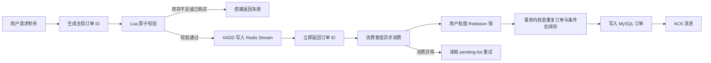
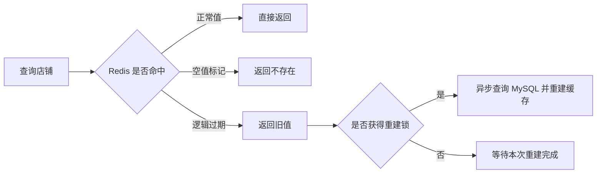

# 高并发点评与优惠券秒杀系统

> 基于 Spring Boot、Redis 与 MySQL 构建的本地生活点评后端项目。围绕热点店铺访问和秒杀下单两个高并发场景，分别处理缓存穿透、缓存击穿、库存超卖、重复下单与异步削峰问题。


## 项目亮点

- **热点店铺缓存治理**：空值缓存用于拦截不存在的店铺请求；逻辑过期策略让旧值可用，并由独立线程异步重建热点缓存，降低缓存失效瞬间大量请求穿透数据库的风险。
- **秒杀原子校验**：Lua 脚本在 Redis 内一次完成库存判断、库存扣减和“一人一单”校验，避免多条 Redis 命令在并发下产生竞态。
- **异步下单与故障补偿**：秒杀请求通过 Redis Stream 写入订单消息；消费者组异步创建订单并 ACK，发生异常时继续处理 pending-list 中未确认消息。
- **多层一致性兜底**：用户粒度 Redisson 锁、数据库内的重复订单校验及条件库存扣减共同约束并发写入；最终创建订单与扣库存处于事务边界内。
- **社交与位置服务**：支持关注关系、共同关注、关注推送、滚动分页的 Feed 流，以及 Redis GEO 附近商户查询。

## 核心链路

### 秒杀下单



Lua 脚本以优惠券 ID 和用户 ID 组成库存、下单记录键，在 Redis 端完成 `GET / SISMEMBER / DECR / SADD / XADD`；数据库层仍会再次校验重复订单并以 `stock >= 1` 作为扣减前置条件，避免异步消费重试或跨层异常导致超卖。

### 热点店铺查询



## 已覆盖能力

| 场景 | 实现要点 |
| --- | --- |
| 手机号登录 | 验证码登录、Redis 保存登录态、拦截器刷新 Token 有效期 |
| 店铺查询 | 缓存穿透防护、逻辑过期、缓存重建、Redis GEO 附近查询 |
| 优惠券秒杀 | Lua 原子校验、Redis Stream 消费者组、pending-list 重试、Redisson 锁、数据库事务 |
| 社交互动 | 点赞、关注/取关、共同关注、粉丝推送、ZSet Feed 流滚动分页 |
| 内容与评论 | 探店笔记发布、浏览、点赞、评论与分页查询 |

## 技术架构

```text
src/main/java/com/hmdp/
├── controller/       # HTTP 接口
├── service/impl/     # 业务编排：缓存、秒杀、关注、Feed 流
├── mapper/           # MyBatis-Plus 数据访问
├── interceptor/      # Token 刷新与登录校验
├── config/           # Redis、MVC、MyBatis 配置
└── utils/            # 缓存客户端、分布式 ID、锁与上下文工具

src/main/resources/
├── scripts/seckill.lua  # Redis 原子秒杀脚本
└── mapper/              # Mapper XML
```

## 本地启动

### 环境要求

- JDK 8
- Maven 3.6+
- MySQL 8（数据库名：`hmdp`）
- Redis 6+

### 配置

在本机配置 MySQL 与 Redis 连接信息后启动。仓库中的应用配置仅适合作为本地开发参考；公开部署或提交前请将账号、密码等敏感值移至未跟踪的本地 Profile 或环境变量，切勿使用真实生产凭据。

### 运行与测试

```bash
# 编译
mvn clean compile

# 启动（默认端口见 application.yaml）
mvn spring-boot:run

# 测试
mvn test
```

## 面试可追问点

- 为什么 Lua 校验后还需要数据库条件扣减和重复订单校验？
- Redis Stream 的 pending-list 在什么情况下产生，为什么需要处理？
- 逻辑过期为什么允许返回旧值，它和互斥锁方案的取舍是什么？
- 如何保证同一用户不会对同一优惠券重复下单？

## 说明

项目聚焦 Redis 在高并发业务中的工程用法。压测结论应以实际运行环境、数据规模和压测脚本为准；本仓库 README 不将示例数据或本地测试结果表述为生产指标。
